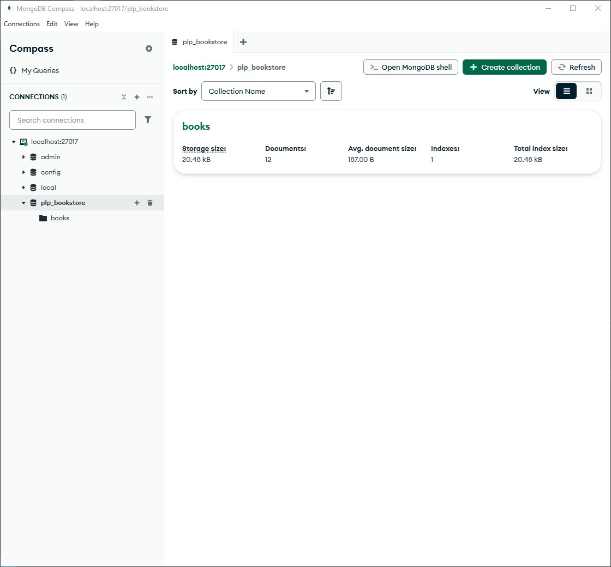
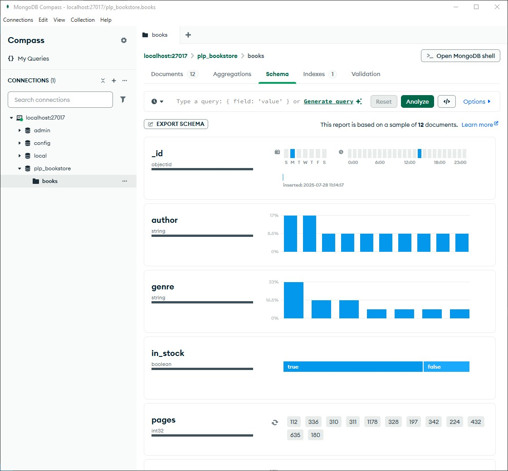
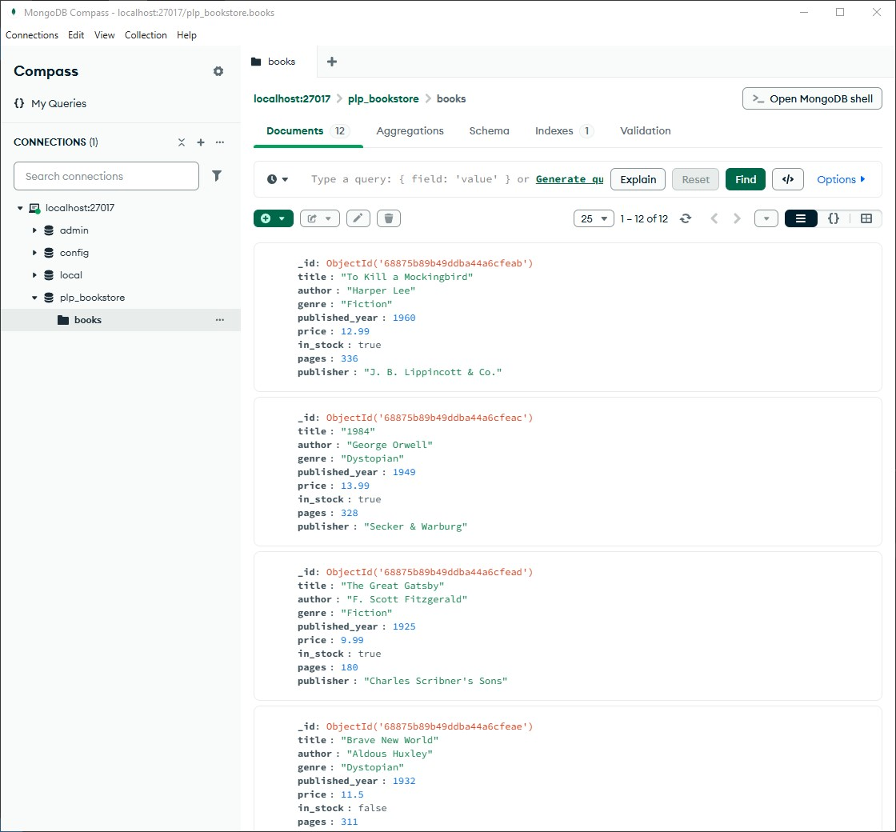

[](https://classroom.github.com/online_ide?assignment_repo_id=19992435&assignment_repo_type=AssignmentRepo)

# MongoDB Fundamentals Assignment

This assignment demonstrates comprehensive MongoDB fundamentals including database setup, CRUD operations, advanced queries, aggregation pipelines, and indexing optimization.

## Assignment Overview

Complete implementation of MongoDB operations covering:
- Database setup and data population
- Basic and advanced CRUD operations
- Complex filtering, projection, and sorting
- Aggregation pipelines for data analysis
- Index creation and performance optimization

## Setup Instructions

### Prerequisites
- [x] **Node.js v22.12.0** (installed)
- [x] **npm v11.0.0** (installed)  
- [x] **MongoDB Community Edition** (installed and running)
- [x] **MongoDB Compass** (installed for GUI access)

### Installation & Execution

1. **Clone the repository**:
   ```bash
   git clone <your-repo-url>
   cd week-1-mongodb-fundamentals-assignment-NMsby
   ```

2. **Install dependencies**:
   ```bash
   npm install mongodb
   ```

3. **Verify MongoDB connection**:
   - Ensure MongoDB service is running
   - Connect via MongoDB Compass: `mongodb://127.0.0.1:27017`

4. **Populate the database**:
   ```bash
   node insert_books.js
   ```
   Expected output: `12 books were successfully inserted into the database`

5. **Execute all queries**:
   ```bash
   node queries.js
   ```

## Database Structure

- **Database**: `plp_bookstore`
- **Collection**: `books` 
- **Document Count**: 12 books
- **Schema**: `title`, `author`, `genre`, `published_year`, `price`, `in_stock`, `pages`, `publisher`

## File Structure

```
├── insert_books.js          # Database population script
├── queries.js               # Complete MongoDB operations
├── README.md               # Project documentation
├── Week1-Assignment.md     # Assignment specifications
└── .github/
    └── classroom/
        └── autograding.yaml # Automated testing configuration
```

## Query Results Summary

### Basic CRUD Operations
- **Fiction books**: 4 found (To Kill a Mockingbird, The Great Gatsby, The Catcher in the Rye, The Alchemist)
- **George Orwell books**: 2 found (1984, Animal Farm)
- **Books after 1950**: 4 found
- **Price update**: Successfully updated "1984" to $13.99
- **Delete operation**: Successfully removed test document

### Advanced Queries
- **Complex filtering**: Books in stock AND published after 2010 (0 results - expected)
- **Projection**: Limited fields display working correctly
- **Sorting**: Price ascending/descending implemented
- **Pagination**: 5 books per page successfully implemented

### Aggregation Analysis
- **Average price by genre**: Fantasy ($17.49) > Dystopian ($12.75) > Adventure ($12.50)
- **Most prolific author**: George Orwell (2 books)
- **Decade distribution**: Books span from 1810s to 1980s with varying concentrations

### Performance Optimization
- **Title index**: Created successfully (`title_1`)
- **Compound index**: Created on author + published_year (`author_1_published_year_-1`)
- **Query performance**: 4ms execution time with index utilization confirmed

## Documentation

Screenshots included demonstrate:
- MongoDB Compass database structure

- Document schema and data integrity

- Collection statistics and indexing information


---  

**Assignment completed successfully with full MongoDB fundamentals implementation** 